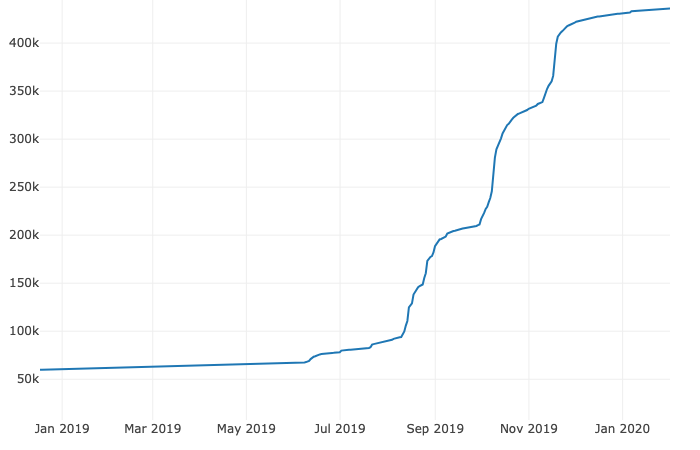

# Language Analysis in Reddit comments
Contributor: Wayne Lam

## Project Outline:
In early to mid-2019, the Hong Kong government tried to pass an extradition bill establishing a mechanism for transfer of fugitives between Hong Kong, Taiwan, and China.  The ensuing backlash amongst many Hong Kongers lead to an upsurge of international attention.  This project aims to understand whether or not particular topics on the r/HongKong subreddit certain sentiments.

## Initial Exploratory Data:
- Subscriber count of r/HongKong through 2019 (image taken from https://subredditstats.com/r/HongKong)

